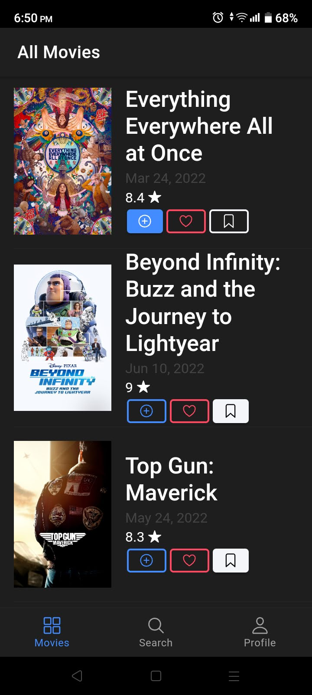
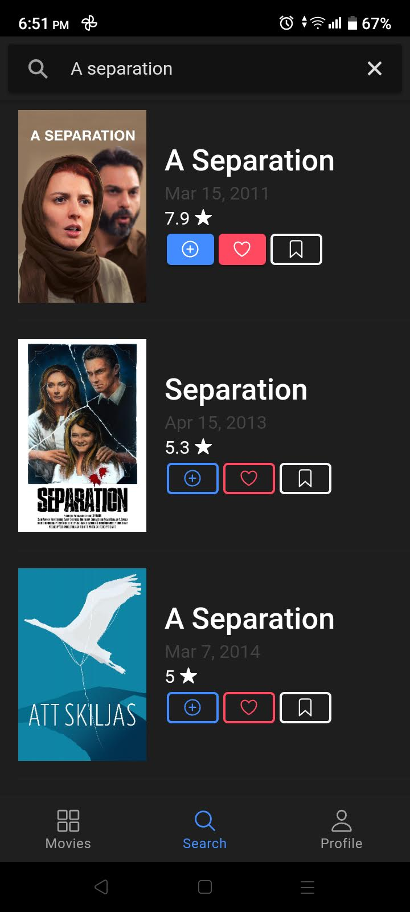
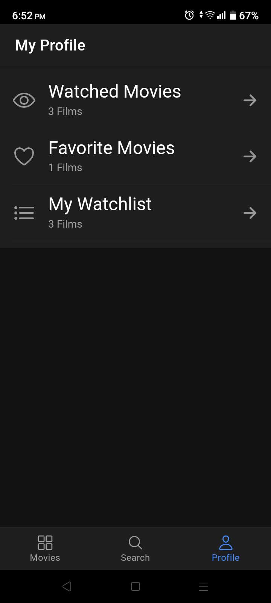

# Ionic Movie Diary with Notes Simple App

This app is built with **Ionic** and **Angular**.

## Features

- Home Page
  - Shows a list of trending movies.
- Search Page
  - Shows movies based on the search query.
- Profile Page
  - Shows the user's watched movies, favorite movies, and watchlist.
- Movie Detail Page
  - Shows the movie's details and allows user to perform actions (Add to watched, favourite or watchlist).
- Movie Overview Component
  - Shows the movie's poster and title.
  - Allows user to perform actions (Add to watched, favourite or watchlist).
  - Shows the movie's release date.
  - Shows the movie's rating.

## Screenshots

  
  
  
  

